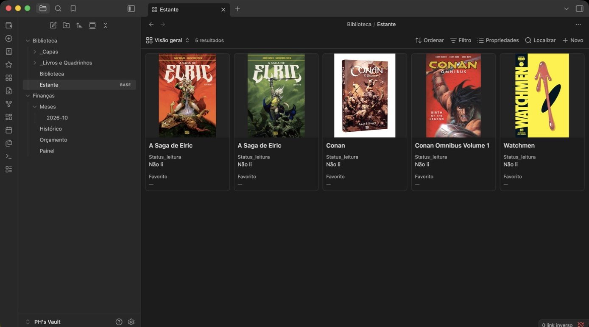
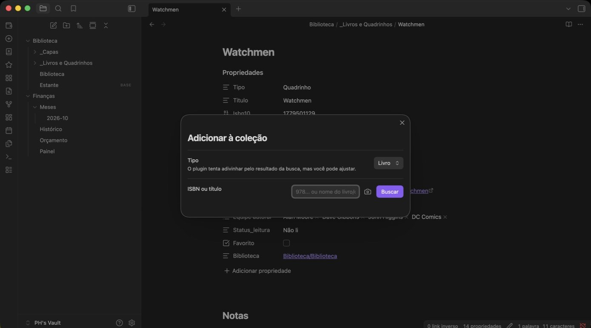
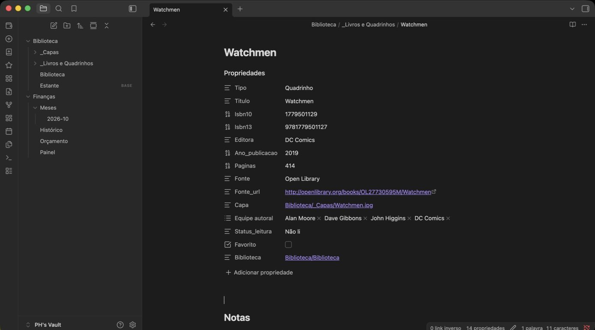
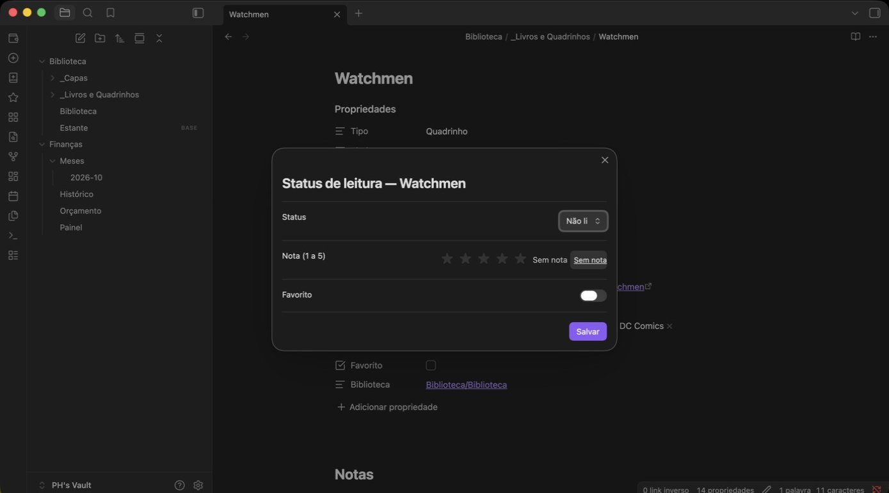
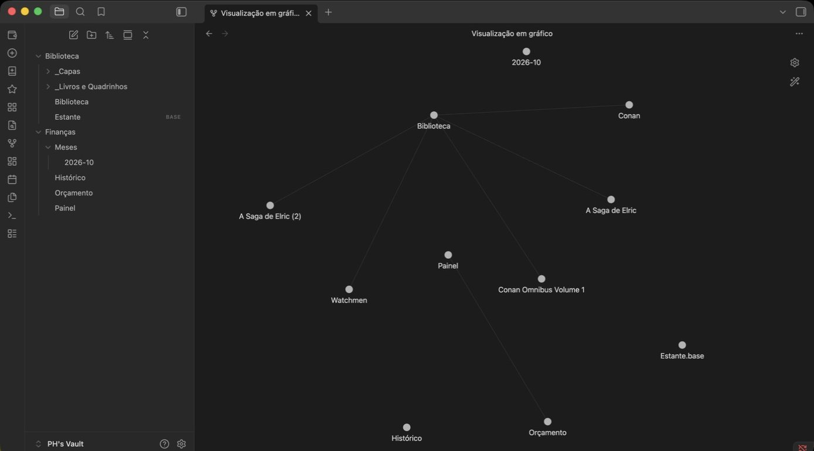
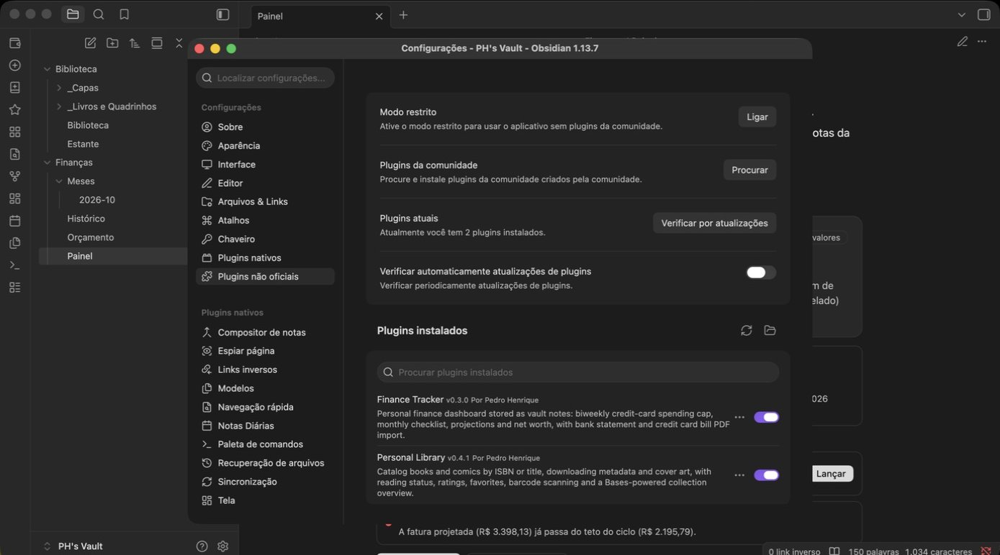

# Personal Library

Plugin para [Obsidian](https://obsidian.md) que transforma seu vault em um catálogo pessoal de livros e quadrinhos: busque por ISBN ou título, deixe o plugin baixar capa, autor, editora, número de páginas e outros metadados, e tenha uma nota pronta para anotar impressões, citações ou colar fotos — tudo isso com uma visão geral visual da coleção e integração nativa com o Grafo do Obsidian.

> Nome interno (id do plugin, não muda entre versões): `colecao-livros-quadrinhos`. O nome de exibição, no Obsidian e no GitHub, é **Personal Library**.



## Funcionalidades

### Catalogação

- **Busca por ISBN ou título**, cruzando [Google Books](https://developers.google.com/books) e [Open Library](https://openlibrary.org/developers/api) — o que faltar em uma fonte é complementado pela outra, e o plugin tenta adivinhar automaticamente se o resultado é um livro ou um quadrinho.
- **Leitura de código de barras pela câmera do dispositivo**, para pegar o ISBN direto do livro/quadrinho físico sem digitar nada.
- **Cadastro manual** como alternativa, para quando a busca automática não encontra nada — comum em edições de editoras nacionais menores ou em quadrinhos sem ISBN.
- **Completa automaticamente o ISBN-10/13** quando você só informa um dos dois, através da conversão matemática padrão entre os formatos.
- **Capa baixada localmente** para o vault (não fica dependendo de um link externo) e vinculada à nota.



### Livros e quadrinhos como tipos separados

Cada tipo tem seus próprios campos de metadados, preenchidos automaticamente pela busca:

- **Livros**: título, autor, tradutor, editora, edição, ano de publicação, número de páginas, ISBN-10/13.
- **Quadrinhos**: título, equipe autoral (roteiro, arte, etc.), editora, ano de publicação, número de páginas, ISBN-10/13.



### Acompanhamento de leitura

- **Status de leitura**: não li, quero ler, lendo, já li, relendo — com data de início/fim de leitura preenchida automaticamente a cada mudança de status, e uma propriedade numerada para cada releitura.
- **Nota de 0,5 a 5 estrelas.**
- **Marcação de favorito.**

Tudo isso é editado em um modal rápido, sem precisar abrir as propriedades da nota manualmente:



### Visão geral da coleção

- **Visão em [Bases](https://help.obsidian.md/bases)** (a feature nativa do Obsidian para tabelas/views dinâmicas sobre notas): cards com capa, separados por tipo (livros/quadrinhos), além de uma visão em tabela com todos os itens. Gerada automaticamente na primeira vez que o plugin é ativado — sem nenhuma configuração manual.
- **Nota "Biblioteca" linkada automaticamente** a cada livro/quadrinho cadastrado, permitindo visualizar a coleção inteira conectada no **modo Grafo** do Obsidian — útil para ter uma visão de conjunto ou para quem gosta de navegar o vault via grafo.



### Internacionalização

- **Interface em Português, English ou 中文** — e as propriedades das notas criadas a partir da troca de idioma seguem o idioma selecionado.

## Instalação

Este plugin ainda não está na lista oficial de plugins da comunidade do Obsidian — é distribuído por releases manuais no GitHub. Para instalar:

1. Baixe `main.js`, `manifest.json` e `styles.css` da [última release](../../releases/latest).
2. Copie os três arquivos para `<seu-vault>/.obsidian/plugins/colecao-livros-quadrinhos/`.
3. No Obsidian, vá em **Configurações → Plugins da comunidade**, desative o "Modo restrito" se necessário, e ative **Personal Library** na lista de plugins instalados.



## Uso

- Ícone **"Adicionar à coleção"** na barra lateral (ou o comando equivalente na paleta de comandos) abre a busca — pelo campo de texto ou pelo ícone de câmera, para escanear o código de barras.
- Ícone **de estrela** na barra lateral (ou o comando "Atualizar status de leitura", disponível também no menu de contexto da nota) abre o status de leitura, nota e favorito do item aberto.
- Ícone **de grade** na barra lateral (ou o comando "Criar/abrir visão geral da coleção") abre a visão geral em Bases.

### Sobre a permissão de câmera

A leitura de código de barras usa a câmera do dispositivo só enquanto a janela de escaneamento estiver aberta — nenhuma imagem ou vídeo é salvo ou enviado para fora do seu computador. Na primeira vez, o sistema operacional (ou o navegador, no caso do Obsidian mobile/web) pede sua permissão explícita; se você negar ou fechar a janela, o plugin simplesmente não consegue escanear e pede para tentar de novo ou digitar o ISBN manualmente.

## Configurações

| Opção | Descrição |
|---|---|
| Pasta da coleção | Pasta principal (por padrão, "Biblioteca"), dentro da qual ficam as subpastas de notas e de capas. Em branco, segue o padrão do idioma selecionado. |
| Pasta dos livros e quadrinhos | Subpasta (dentro da pasta da coleção) onde as notas de cada livro/quadrinho são criadas. Em branco, uma subpasta padrão dentro da pasta da coleção. |
| Pasta das capas | Onde as capas baixadas são salvas. Em branco, uma subpasta dentro da pasta da coleção. |
| Chave de API do Google Books | Opcional — aumenta o limite de requisições diárias. |
| Idioma da interface | Português, English ou 中文. Afeta a interface e as propriedades de itens cadastrados a partir da troca. |

## Privacidade

O plugin só se comunica com as APIs do Google Books e da Open Library (para buscar metadados e capas) e, opcionalmente, com a câmera do dispositivo (só durante o escaneamento de código de barras, localmente). Nenhum dado é enviado para nenhum outro serviço.

## Desenvolvimento

```bash
npm install
npm run dev    # build com watch
npm run build  # build de produção
```

## Licença

[MIT](LICENSE)
